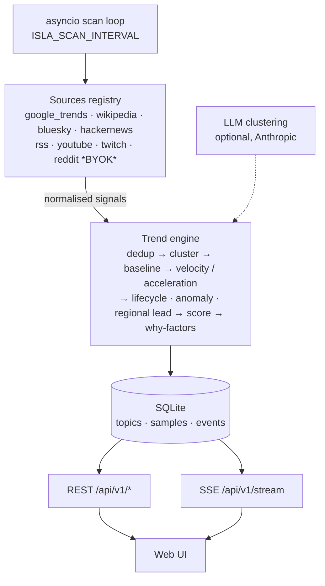

# ISLA

**Open-source global viral intelligence network.** Signals in → trends out —
measured between real samples, never invented.

[](https://github.com/aislamsilvalol-ctrl/isla/actions/workflows/ci.yml)
[](./LICENSE)

ISLA watches public sources (search, encyclopedic attention, social trends,
live streams, communities, front pages, any RSS feed) and answers one
question before everyone else: **what is about to go viral?**

It is the virality-tracking engine born inside [USINA]. Extracted here as a
standalone, self-hostable tool.

## Honesty rules (non-negotiable)

- **No invented virality.** Velocity = Δengagement between real samples.
  Without 2 samples ISLA says `collecting baseline`, never a made-up number.
- **No fake real-time.** Every source declares its true freshness
  (`~15m RSS`, `daily`, `live`).
- **Explainable, always.** Every trend answers *why is this trending* with
  observable factors — never a magic score alone.
- **Provenance for everything.** Every number on screen traces back to real
  source URLs and timestamps.
- **Simulated is labeled.** Demo mode lives in a separate database and the
  UI shows a loud `SIMULATED DATA` banner. Real and fake never mix.
- **Acceleration beats size.** A small topic accelerating outranks a huge
  saturated one.
- **Official/public APIs only.** BYOK — bring your own keys; none required
  to start.

## Quick start

```
pip install -e .
isla scan       # sweep all configured sources (4 work with ZERO keys)
isla top        # live topics ranked by opportunity
isla sources    # source health / what each key unlocks
isla replay     # recompute all metrics from stored samples (no network)
isla demo       # seed a SEPARATE demo db with clearly-labeled fixtures
```

Works out of the box with **Google Trends (per country), Wikipedia
pageviews, Bluesky trends and Hacker News — no API keys**. Add keys in
`.env` to unlock YouTube, Twitch, Reddit and any RSS feed (see
`.env.example`).

Optional: `ANTHROPIC_API_KEY` upgrades topic clustering with an LLM;
without it a deterministic heuristic does the job.

## Web UI + live stream

```
pip install -e '.[serve]'
isla serve --port 8800
```

Open `http://localhost:8800` — a dense, keyboard-driven control room:

- **World Pulse** — country-level intensity, only from sources that actually
  report geography (never invented).
- **Trends** — state labels `QUIET → MOVING → EMERGING → ACCELERATING →
  BREAKOUT → VIRAL`, sparklines from real series, velocity, confidence.
- **Emerging** — what might go viral next (sorted by acceleration, boosted
  by multi-source confirmation).
- **Live stream** — the server scans in the background and pushes results
  over SSE; the screen reacts when the world moves.
- **Trend drawer** — *why is this trending* (observable factors) + full
  provenance: every traced signal with its source, URL and engagement.
- **System** — connector health (`HEALTHY / RATE_LIMITED / OFFLINE /
  MISCONFIGURED`), latency, scan timing. Real states, no fake numbers.
- `⌘K` command palette · `DENSE/FOCUS` density toggle.

## API (v1)

```
GET /api/v1/trends?sort=opportunity|rising|engagement
GET /api/v1/trends/{id}      # detail + why + provenance events
GET /api/v1/emerging
GET /api/v1/sources          # connector health states
GET /api/v1/stats
GET /api/v1/stream           # SSE: scan.completed events, 25s heartbeat
GET /api/v1/health
```

Interactive OpenAPI docs at `/docs`.

## What you get per topic

```
[ 87] gta 6                      BREAKOUT     +148%  LEAD:US
      velocity, acceleration, jerk, lifecycle, source diversity,
      anomaly vs own baseline, confidence (LOW/MED/HIGH), regional lead,
      label (QUIET→VIRAL), sparkline series, why-factors, provenance
```

`LEAD:US` = strong abroad, absent in your home region — your early window.
Label thresholds are calibratable: `ISLA_SCORE_THRESHOLDS=20,40,60,75,90`.

## Architecture

One process, one file of state. The full write-up, including the data model
and the scoring pipeline, is in [docs/ARCHITECTURE.md](docs/ARCHITECTURE.md).



## Build your own source

Every source is a small adapter returning normalized signals. See
[docs/SOURCE_SDK.md](docs/SOURCE_SDK.md) — ~20 lines gets you a new source.
Architecture and scaling path: [docs/ARCHITECTURE.md](docs/ARCHITECTURE.md).

## Security

Public APIs only, credentials from environment variables only, nothing
written to logs. Report vulnerabilities through
[private vulnerability reporting](https://github.com/aislamsilvalol-ctrl/isla/security/advisories/new);
details in [SECURITY.md](SECURITY.md).

## Contributing

Small, honest PRs. Setup, source SDK and commit conventions are in
[CONTRIBUTING.md](CONTRIBUTING.md).

## License

[MIT](LICENSE) — use it, fork it, build on it. If you ship something with
ISLA inside, a link back is appreciated (not required).
